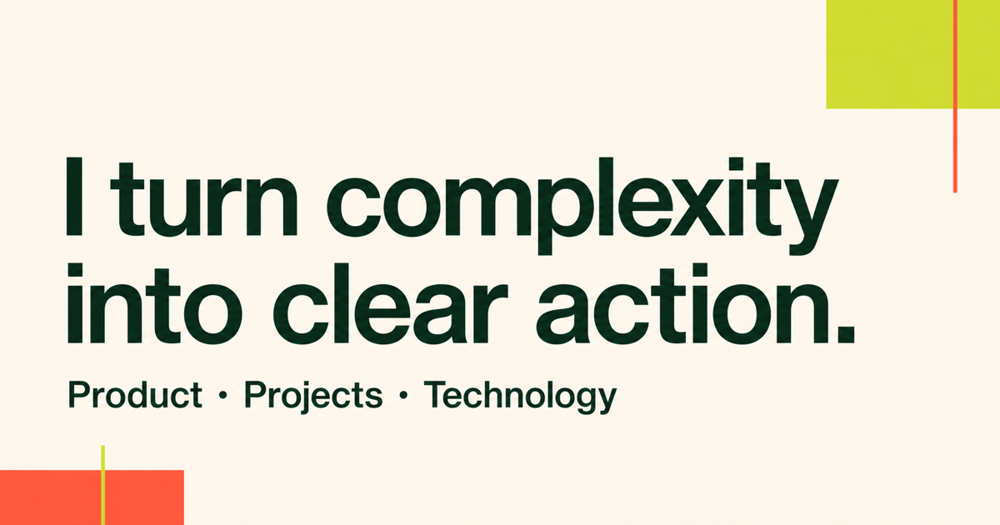

# Nae Pathsharasakon — Career Portfolio

Career-transition portfolio for opportunities in Junior IT Business Analysis, IT Project Coordination, Product Operations, and Implementation.

[View the live portfolio](https://from-music-to-product-2026.pathsharasakon.chatgpt.site)



## From music to product delivery

My background spans music education, community events, and software development. Across those chapters, the consistent pattern is the same: listen carefully, create structure, align people, and move work forward.

## Featured case study

### Fashion E-commerce Mix & Match Lookbook

A five-person Generation Thailand project that turns outfit inspiration into a useful buying journey.

My responsibilities:

- Project lead and team coordination
- Requirements and backlog breakdown
- Diagrams and wireframe collaboration
- Admin backend, database, API, and mock data
- Sprint planning and delivery follow-up

Project status: Sprint 2, in progress. Demo and product screenshots will be added after Sprint 3.

## Core skills

- User and stakeholder discovery
- Requirements and process mapping
- Planning and team coordination
- Backend, API, and data foundations
- Clear communication and facilitation

## Technology

- React and TypeScript
- Express and REST APIs
- MongoDB and SQL foundations
- Git and GitHub
- Figma, Miro, Trello, and Agile/Scrum

## Development

```bash
npm install
npm run dev
```

Create a production build with:

```bash
npm run build
```

## Contact

- [LinkedIn](https://www.linkedin.com/in/pathsharasakon-po-6902b029b)
- [GitHub profile](https://github.com/pathsharasakon-ws)
- [Portfolio source](https://github.com/pathsharasakon-ws/nae-career-portfolio)
- Email: pathsharasakon@gmail.com
