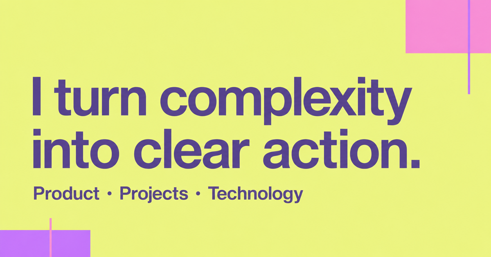

# Nae Pathsharasakon — Career Portfolio

Career-transition portfolio for opportunities in Junior IT Business Analysis, IT Project Coordination, Product Operations, and Implementation. Built around the idea **“From Rhythm to Systems”** and the working approach **Listen → Connect → Move**.

[View the live portfolio](https://from-music-to-product-2026.pathsharasakon.chatgpt.site)



## From music to product delivery

My background spans music education, community events, and software development. Across those chapters, the consistent pattern is the same: listen carefully, create structure, align people, and move work forward.

I am a graduate of Generation Thailand's Junior Software Developer programme (JSD13), where I completed full-time MERN training and worked as Project Lead and Backend Developer in a five-person product team.

## Featured case study

### Fashion E-commerce Mix & Match Lookbook

A completed five-person Generation Thailand team project that turns outfit inspiration into a useful buying journey through a fashion e-commerce experience with Mix & Match / Lookbook functionality.

- [Customer e-commerce experience](https://jsd13-group3-hydra-ranger.vercel.app/)
- [Admin dashboard](https://occasion-admin-dashboard.vercel.app/login)
- [Project repository](https://github.com/pathsharasakon-ws/group-project-3)

My responsibilities:

- Project Lead and Backend Developer
- Team coordination and delivery follow-up
- Requirements and backlog breakdown
- Diagrams and wireframe collaboration
- Admin backend, database, API, and mock data
- Sprint planning and prioritisation

Project status: **Completed and deployed.** These are delivered project outcomes, not claims of measured business impact. The application was produced collaboratively by a five-person team.

## Portfolio design system

- Brand palette: `#EDF67D`, `#F896D8`, `#CA7DF9`, `#724CF9`, and `#564592`
- Main canvas background: `#F3FAE1`
- Interactive piano accent: `#C5E34A`
- High-contrast pairings use deep purple with light lime
- Geist Sans for primary copy and headings
- Geist Mono for labels, metadata, and system details
- Minimum readable sizes maintained across desktop and mobile
- Reduced-motion preferences respected

## Core skills

- User and stakeholder discovery
- Requirements and process mapping
- Planning and team coordination
- Backend, API, and data foundations
- Clear communication and facilitation

## Technology

- React and TypeScript
- Express and REST APIs
- MongoDB and SQL foundations
- Git and GitHub
- Figma, Miro, Trello, and Agile/Scrum

## Development

```bash
npm install
npm run dev
```

Create a production build with:

```bash
npm run build
```

## Contact

- [LinkedIn](https://www.linkedin.com/in/pathsharasakon-po-6902b029b)
- [GitHub profile](https://github.com/pathsharasakon-ws)
- [Portfolio source](https://github.com/pathsharasakon-ws/nae-career-portfolio)
- Email: pathsharasakon@gmail.com
